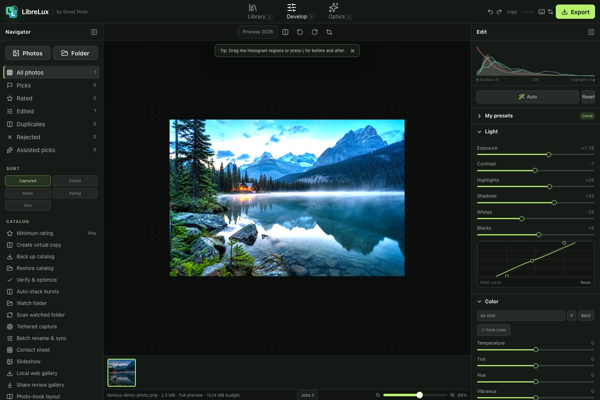
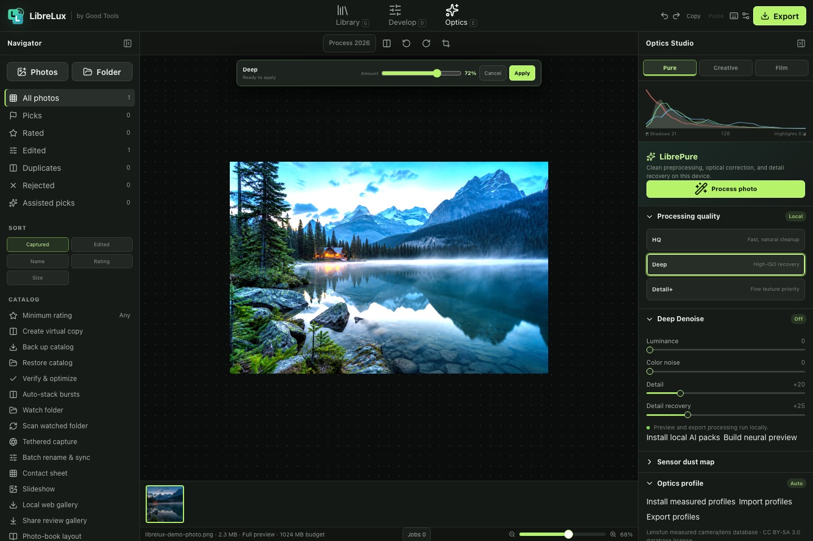

# LibreLux

LibreLux is a free, open-source photo workflow and RAW editing web app from [Good Tools](https://goodtools.ca). It combines a familiar library and develop workflow with local-first color grading, optical correction, film looks, masking, retouching, batch export, and optional on-device AI.

[Open LibreLux](https://librelux.goodtools.ca) · [Good Tools product page](https://goodtools.ca/tools/librelux)





## Highlights

- Library, Develop, and Optics workspaces
- RAW and common image import with non-destructive editing
- Exposure, tone curves, HSL, color grading, calibration, B&W mixing, and soft proofing
- Local masks for subjects, hair, skin, clothes, sky, backgrounds, luminance, color, and depth ranges
- Lens correction, denoise, detail recovery, creative effects, film emulation, and measured profiles
- Local catalog persistence, editable save locations, backup and restore, review comments, and ratings
- Batch processing, background workers, 16-bit TIFF, linear DNG, and 32-bit HDR master export
- Browser-local AI packs with WebGPU and WASM fallback
- Keyboard access, reduced motion, high contrast, and 200% interface text support

Photos and catalog data stay on the device unless the user explicitly exports or shares something.

## Run locally

Requirements: Node.js 22.13 or newer and pnpm.

```bash
pnpm install
pnpm dev
```

Open `http://localhost:5173`.

## Validate a release

```bash
pnpm build
pnpm test:release
pnpm audit:release
```

The browser test matrix covers Chromium, Firefox, WebKit, and a tablet viewport.

## Open data and optional models

LibreLux can download optional resources at the user's request:

- [Lensfun](https://github.com/lensfun/lensfun) measured camera and lens data — CC BY-SA 3.0 database license
- [darktable SpektraFilm](https://github.com/darktable-org/darktable-spektrafilm) measurement data — CC BY-SA 4.0
- [Swin2SR](https://huggingface.co/Xenova/swin2SR-lightweight-x2-64) and [SegFormer clothes](https://huggingface.co/Xenova/segformer_b0_clothes) browser-local model packages — see each model card for its license and upstream attribution

These resources keep their own licenses and are not relicensed by LibreLux. See [THIRD_PARTY_NOTICES.md](THIRD_PARTY_NOTICES.md).

## Contributing

Issues and pull requests are welcome. Please keep photo processing local-first, preserve keyboard and accessibility behavior, and include a focused test for user-facing workflow changes.

## License

LibreLux is released under the [MIT License](LICENSE).
